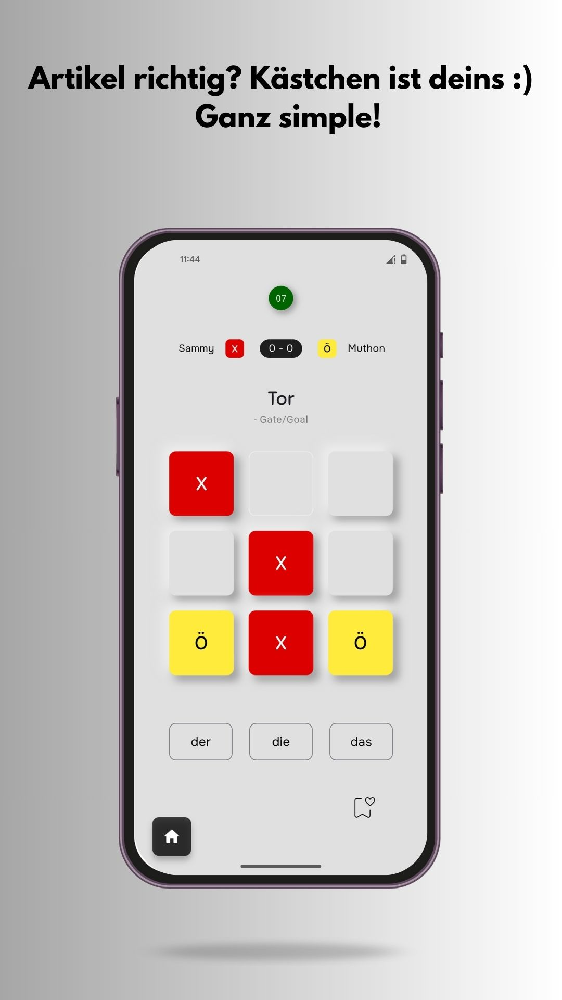
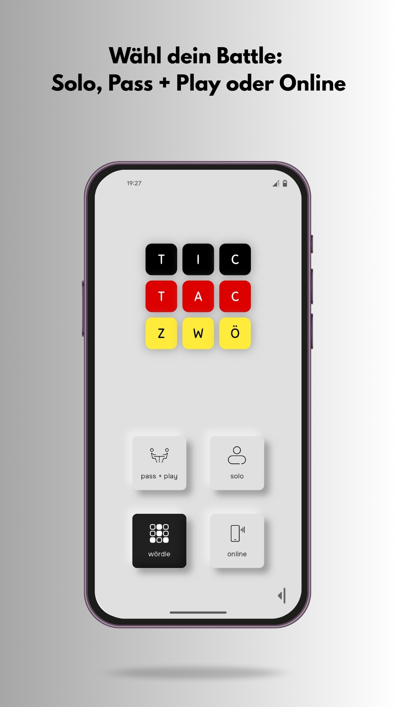
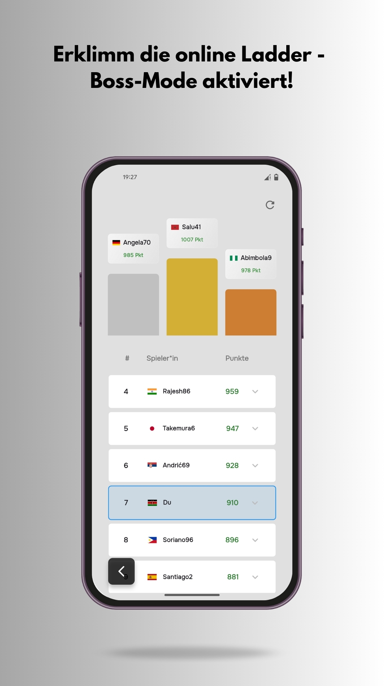

# Tic Tac Zwö

  
  
  

## About
This is a full-stack Flutter application (Android & iOS) designed to help German learners master noun articles (Der, Die, Das) by embedding the learning mechanic into the classic Tic Tac Toe.

* **Multiplayer & Solo Modes:** Play online against friends (realtime), pass-and-play, or challenge a solo AI.
* **AI Difficulty Levels:** The solo AI features Easy, Medium, and Hard modes.
* **Bonus Word Game:** Includes "Wördle," a German-themed Wordle clone to build vocabulary.
* **Backend Integration:** Full user authentication, realtime database for online matches, user stats, and online leaderboard.
* **In-App Feedback:** Integrated a user feedback tool (Wiredash) to collect bug reports and suggestions.

## Tech Stack
- **Framework**: Flutter (Dart)
- **State Management**: Riverpod
- **Backend/Database**: Supabase
- **Core Packages**: `supabase_flutter`, `flutter_riverpod`, `wiredash`

## Installation (Android)
1. Download the latest APK from the [Releases](https://github.com/3llips3s/tic-tac-zwo/releases) page.
2. Open the APK on your Android device.
3. If prompted, allow "Installation from Unknown Sources".
4. Install and enjoy :)

## License
MIT License. See [LICENSE](LICENSE) for details.
